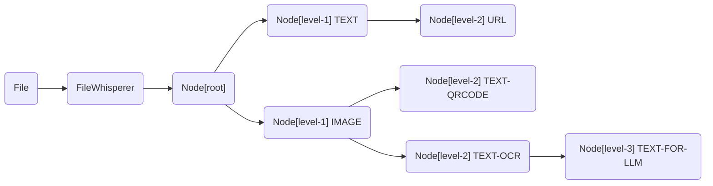

# proto

```
message WhisperReply {
  repeated Node tree = 1;
}

message Meta {
  map<string, string> map_string = 1;
  map<string, int64> map_number = 2;
  map<string, bool> map_bool = 3;
}

message Node {
  int64 id = 1;
  int64 parent_id = 2;
  repeated int64 children = 3;
  oneof content {
      File file = 4;
      Data data = 5;
  }
  Meta meta = 6;
}

message File {
    string path = 1;
    string name = 2;
    int64 size = 3;
    string mime_type = 4;
    string extension = 5;
    string md5 = 6;
    string sha256 = 7;
    string sha1 = 8;
    optional bytes content = 9;
}

message Data {
    string type = 1;
    bytes content = 2;
}

```

# desc

## WhisperReply

FileWhisperer 的扫描结果的数据结构为 WhisperReply 形式，文件提取出来的数据都为 `Node` 连接在一起。  

以下为一种示例：  




## Node 

  int64 id = 1;
  int64 parent_id = 2;
  repeated int64 children = 3;
  oneof content {
      File file = 4;
      Data data = 5;
  }
  Meta meta = 6;

解析数据的数据表示为 tree，由若干个 Node 构成。  

Node 有 id、parent_id、children 来表示 Node 处在解析后的数据的哪个层级上。  

`id` 是 Node 的标识，可以类比为 Node 的"地址"，第一个 Node（即根Node） 的 id 可由调用方设置，派生出的 Node 的 id 分配一个雪花 id。  

`parent_id` 是 Node 的上一级 Node，表明其从哪个 Node 得到的。  

`children` 是 Node 提取出来的若干个 Node。  

`file`/`data` 表明 Node 是文件类型还是二进制类型。  

`meta` 存放 Node 额外的说明信息。  

